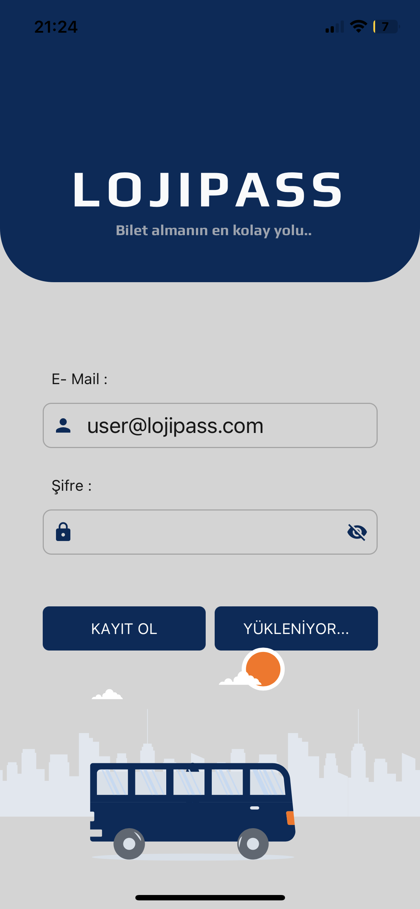

# LOJIPASS - Ticket App

Ticket App, otobüs biletlerinin satışını yapmak için kullanılan bir mobil uygulamadır. Kullanıcılar, bilet arama ve bilet satın alma gibi işlemleri gerçekleştirebilirler. Uygulama, Expo platformu üzerinde geliştirilmiştir ve React Native teknolojisi kullanılarak oluşturulmuştur.

## Kurulum

Proje dosyalarını bilgisayarınıza indirmek veya klonlamak için aşağıdaki adımları takip edebilirsiniz:

- ### Ön Gereksinimler

1. Node.js: Proje için Node.js'in bilgisayarınızda yüklü olması gerekmektedir. Node.js'i [buradan](https://nodejs.org) indirip kurabilirsiniz.

- ### İndirme

Projeyi indirmek veya klonlamak için aşağıdaki adımları izleyin:

1. Projeyi indirmek için [buraya tıklayın](https://github.com/mogretici/lojipass-mobile/archive/refs/heads/main.zip) ve ZIP dosyasını bilgisayarınıza indirin. Ardından ZIP dosyasını çıkarın.

2. Proje dosyalarını klonlamak için terminali açın ve projenin klonlanacağı bir dizin belirleyin. Ardından aşağıdaki komutu çalıştırın:

```bash
git clone https://github.com/mogretici/lojipass-mobile.git
```

## Kullanım

Proje dosyalarını indirdikten veya klonladıktan sonra aşağıdaki adımları izleyerek projeyi kullanabilirsiniz:

1. Terminali açın ve projenin dizinine gidin:

```bash
cd lojipass-mobile
```

2. Proje dizininde aşağıdaki komutları sırasıyla çalıştırarak gerekli paketleri yükleyin ve uygulamayı başlatın:

```bash
yarn global add expo-cli   # Expo CLI'nin yüklü olduğundan emin olun
yarn install              # Gerekli paketleri yükler
npx expo start            # Expo Development Server'ı başlatır
```

Proje, Expo Development Server üzerinde başlayacaktır. Uygulamayı bir Android veya iOS cihazında test etmek için Expo Go uygulamasını [Google Play](https://play.google.com/store/apps/details?id=host.exp.exponent) veya [App Store](https://apps.apple.com/app/apple-store/id982107779) üzerinden indirebilirsiniz.

Uygulama başarıyla başladığında, Expo Development Server'ın sağladığı QR kodu kullanarak uygulamayı bir cihazda çalıştırabilirsiniz. Expo Go uygulamasını açın ve QR kodu taratın. Uygulama, sefer arama, bilet satın alma ve diğer işlevlerle etkileşimde bulunmanıza olanak tanıyacaktır.

## Kullanılan Teknolojiler ve Sürümler

- Expo - v49.0.1: Mobil uygulama geliştirmek için kullanılan bir çerçeve. Expo, React Native projelerinin hızlı bir şekilde başlatılmasını ve geliştirilmesini sağlar.
- React Native - v0.72.1(LTS): Mobil uygulamalar için JavaScript tabanlı bir çerçeve. React Native, iOS ve Android platformlarında aynı kod tabanıyla kullanıcı arayüzleri oluşturmayı sağlar.
- NativeBase - v3.4.28: React Native tabanlı bir UI bileşen kütüphanesi. NativeBase, hazır bileşenler ve tema desteği sağlayarak kullanıcı arayüzlerinin hızlı bir şekilde oluşturulmasını kolaylaştırır.
- Formik - v2.4.2: Form yönetimi için kullanılan bir kütüphane. Formik, form verilerini takip etmek, doğrulamak ve sunmak için kullanışlı bir API sağlar.
- Yup - v1.2.0: Şema tabanlı doğrulama için kullanılan bir kütüphane. Yup, form verilerinin doğruluğunu kontrol etmek ve doğrulama kurallarını tanımlamak için kullanılır.
- Axios - v1.4.0: HTTP istekleri yapmak için kullanılan bir kütüphane. Axios, sunucu ile iletişim kurmak ve API isteklerini yönetmek için kullanılır.
- Lottie React Native - v5.1.6: Animasyonlu vektör grafikleri kullanmak için kullanılan bir kütüphane. Lottie React Native, JSON formatındaki animasyonları kolayca entegre etmeyi sağlar.
- rn-credit-card-ui - v1.1.0: Kredi kartı arayüzünü oluşturmak için kullanılan bir kütüphane. rn-credit-card-ui, kullanıcıya kredi kartı bilgilerini göstermek ve düzenlemek için hazır bir bileşen sağlar.
- React Native Keyboard Aware Scroll View - v0.9.5: Klavye olaylarını algılamak ve kaydırılabilir bir görünümü otomatik olarak ayarlamak için kullanılan bir kütüphane. Klavyeyle etkileşimli formların daha iyi görüntülenmesini sağlar.
- React Native Modal Datetime Picker - v17.0.0: Tarih ve saat seçmek için kullanılan bir modül. React Native Modal Datetime Picker, kullanıcıya modal bir pencere içinde tarih ve saat seçme imkanı sağlar.
- React Native Zigzag View - v0.2.0: Zigzag tarzında arayüzler oluşturmak için kullanılan bir bileşen. Zigzag View, kullanıcı arayüzlerine görsel olarak ilgi çekici bir görünüm sağlar.
- @expo-font - v11.4.0: Expo projelerinde özel fontları kullanmak için kullanılan bir paket. Expo Font, projeye özel font dosyalarını yüklemek ve kullanmak için kullanılır.

## Statik Sefer Verileri

Uygulama için 8 adet statik sefer verisi mevcuttur. Bu veriler, Çanakkale-İstanbul ve İstanbul-Çanakkale arasında gerçekleşen seferleri içermektedir. Aşağıda seferlerin tarih ve saat bilgileri yer almaktadır:

- Çanakkale'den İstanbul'a Seferler:

  - 25.07.2023 - 2 sefer
  - 26.07.2023 - 2 sefer

- İstanbul'dan Çanakkale'ye Seferler:
  - 25.07.2023 - 2 sefer
  - 26.07.2023 - 2 sefer

## Demo Hesap Bilgileri

Uygulama için demo amaçlı kullanılabilir hesap bilgileri aşağıdaki gibidir:

- E-posta: user@lojipass.com
- Şifre: 111111

Bu hesap bilgileriyle uygulamaya giriş yapabilir, seferleri arayabilir ve bilet satın alabilirsiniz.

## Önemli Notlar

- Uygulamadaki kullanıcı girişi ve kullanıcı kaydı için NodeJS ve MongoDB kullanılarak [küçük bir api](https://github.com/mogretici/lojipass-backend) yazılmış olup, ücretsiz bir [Render](https://lojipass.onrender.com/) sunucusuna deploy edilmiştir. Ücretsiz bir sunucu kullanıldığından dolayı, sunucuya yapılan ilk istek üç dakikaya kadar gecikmeli yanıt verebilir. Sunucu kaynaklı sorunlar yaşanmaması için kayıt ekranında doldurulan veriler cache'e kaydedilmektedir. Kayıt ekranında sunucu kaynaklı herhangi bir sorunla karşılaşmanız durumunda, manuel olarak anasayfaya dönerek kayıt formunda girdiğiniz bilgileri kullanarak giriş yapabilirsiniz.

- Uygulama geliştirme sırasında, NativeBase paketi kaynaklı bir uyarı mesajı alıyorsanız, bu uyarı uygulamanın çalışmasına herhangi bir sorun teşkil etmez. Ancak yine de bu uyarı mesajından kurtulmak isterseniz, proje ana dizininde bulunan "patches" klasöründe yer alan düzeltmeyi uygulayabilirsiniz.

- Ödeme işlemleri için bir ödeme geçidi entegrasyonu yapılması gerekmektedir. Bu örnek projede gerçek bir ödeme işlemi gerçekleştirilmemektedir.

- Kullanıcının seçtiği şehirler ve tarihler için statik veriler kullanılmaktadır.

## Ekran Görüntüleri

Aşağıda, projenin bazı ekran görüntüleri bulunmaktadır:

| [](screenshots/screenshot-1.png)       | [](screenshots/screenshot-2.png) | [](screenshots/screenshot-3.png) |
| -------------------------------------------------------------------------------- | ---------------------------------------------------------------------------------- | ---------------------------------------------------------------------------------- |
| [](screenshots/screenshot-4.png) | [](screenshots/screenshot-5.png)       | [](screenshots/screenshot-6.png)        |
